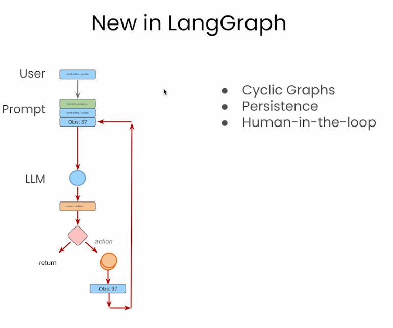

# Start
### Lang Graph Support Cyclic Graphs

Langchain supports graph based agentic workflows to support these! 

# Video 1 - Building an Agent From Scratch - ReAct Pattern
Reasoning + Acting.. 

### ReAct Framework Overview

**ReAct** (Reason + Act) is a framework designed to integrate reasoning and action within a loop involving a Language Model (LM) and an environment (Env). 

#### Key Components:

- **Language Model (LM):** 
  - Generates reasoning traces based on observations.
  - Determines actions to be taken in the environment.

- **Environment (Env):** 
  - Provides observations based on actions taken by the LM.
  - Represents the external context or system with which the LM interacts.

#### Process Flow:

1. **Observation:**
   - The environment provides observations to the language model.
   
2. **Thought/Reasoning:**
   - The LM generates reasoning traces or thought processes based on the observations.
   - This involves internal cognitive processing to interpret the observations and make decisions.
   
3. **Action:**
   - Based on the reasoning, the LM determines and takes actions.
   
4. **Feedback Loop:**
   - Actions taken by the LM affect the environment.
   - The environment then provides new observations as feedback, continuing the loop.

### Applications:
- **Autonomous Systems:** Implementing intelligent behaviour in robotics or AI agents.
- **Interactive AI:** Enhancing user interaction with AI through reasoning and adaptive responses.
- **Decision-Making Systems:** Supporting complex decision-making processes by integrating reasoning with actionable steps.

### Benefits:
- **Integrated Approach:** Combines reasoning and action, improving the decision-making capability of AI systems.
- **Adaptability:** Continuously learns and adapts through feedback from the environment.
- **Enhanced Interaction:** Provides more natural and effective interaction with users or other systems.

Understanding the ReAct framework helps in developing systems that are more capable of reasoning about their actions and adapting to changes in their environment effectively.

# Video 2 - Langgraph Components

### Concepts of Langgraph

### Example Graph

### State

### State Cide

# Lesson 4 Agentic Search Tools/Tavily

## Overarching Agentic Search Arch

## Deep dive of search tool arch

# Lesson 6 - Agent in the loop + Agent State Memory.. 
### State Memory
- thread + thread idneitfier to access snapshots

###

###

###
you can go back in time... and modifying states..

# Lesson 6 - Essay Writer! 

# To finish

- Other resources:
   - https://smith.langchain.com/o/db4c7e87-e556-5e2a-805e-4886a8f9752b/ 

# Types of Agentic Architectures! 
1. Multi-Agent Arch

- where multiple agents work on the same SHARED state
- Passing state around from one agent to the next!

2. Supervisor architectre

- 1 supervisor routing and co-ordinating agents
- 1 agent that does the planning! 

3. Flow Engineering
- first is defined/directed flow
- then iterations.. 

4. Plan And Exeucte Flow

5. Language Agent Tree Search

